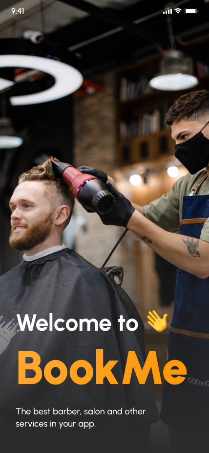
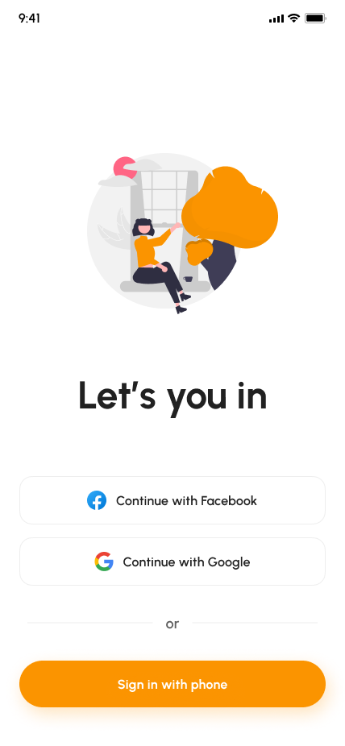
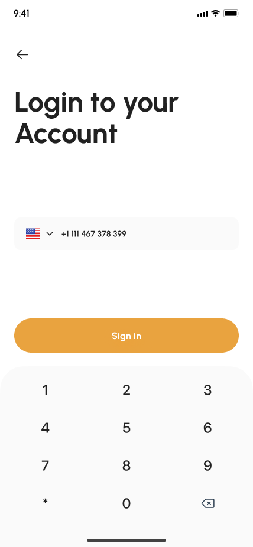
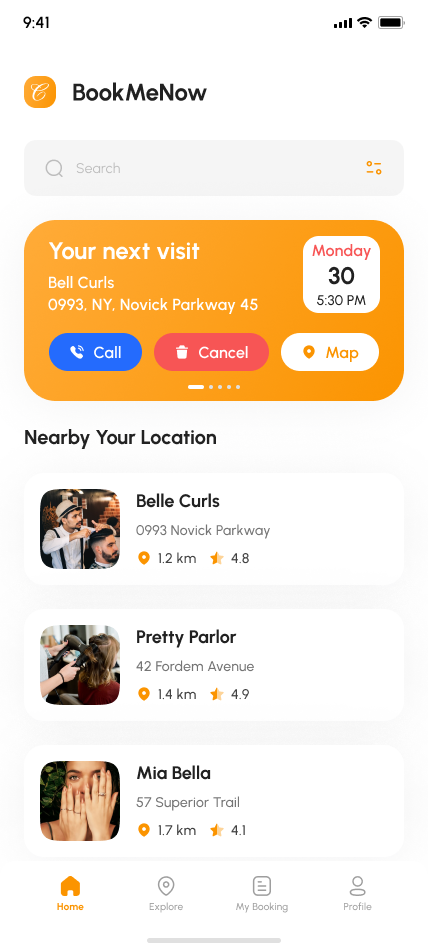
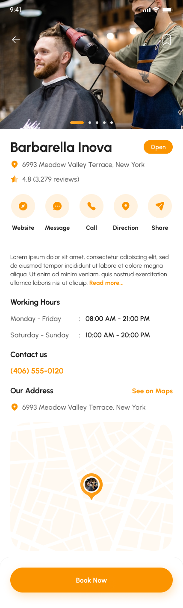
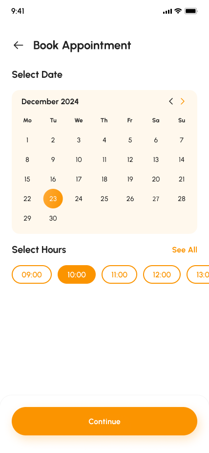
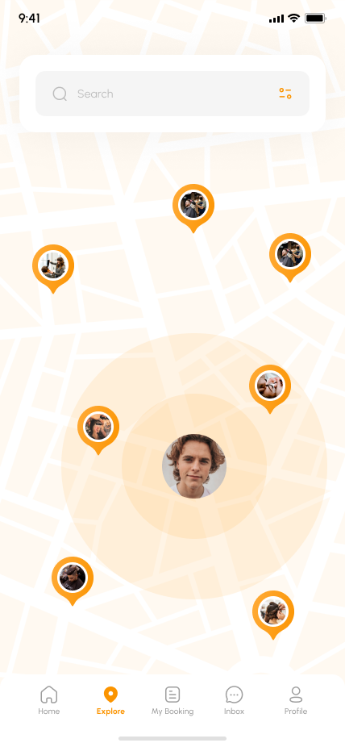
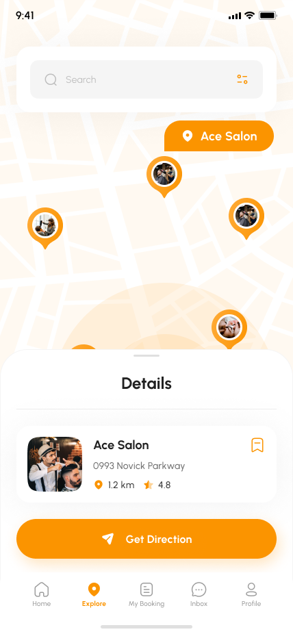

# Project "BookMe"

### Project Description:

*BookMe* is a mobile application designed for finding and booking barber shops, beauty salons, and other services nearby with you. It helps users quickly find nearby establishments, view information about them, and schedule appointments at their convenience.

*Key Features of the Application:*

1. **Search for Establishments:** Users can search for nearby barber shops, beauty salons, and other establishments based on criteria such as location or type of service.

2. **View Establishment Information:** Users can view detailed information about establishments, including address, contact information, hours of operation, description of services, and customer reviews.

3. **Appointment Scheduling:** Users can book appointments at services offered by selected establishments through the application. They can choose a convenient time and date, and add reminders to their calendar.

4. **Schedule Management:** The application allows users to manage their appointment schedule, view upcoming appointments, cancel, and reschedule them at their convenience.

5. **Navigation:** Users can navigate to the selected establishment by using integrated maps and navigation services.

### Technologies:

- **SwiftUI:** For developing the user interface of the mobile application for iOS.
- **Kotlin:** For developing the user interface of the mobile application for Android.
- **Kotlin Multiplatform:** For developing shared components and business logic that can be used in both the Android and iOS mobile applications.

*Target Audience:*

The "BookMe" project targets a wide audience, including young people, professionals, and anyone looking for a convenient way to find and schedule beauty services. This includes both men and women of all ages and social statuses.

#### Advantages of the Application:

- **Ease of Use:** The simple and intuitive interface makes the application accessible to a wide range of users.

- **Time Optimization:** Users can quickly find and book services, saving time and avoiding waiting times.

- **Personalization:** The ability to manage their schedule and add reminders helps users create a personalized appointment schedule.

- **Integration with Maps:** The ability to build routes to establishments makes the visiting process even more convenient and efficient.

*Conclusion:*

The "BookMe" project represents an innovative solution for people who value their time and want to look stylish and well-groomed. This application combines the convenience of finding, booking, and managing appointments in one place, making the self-care process even more enjoyable and efficient.
